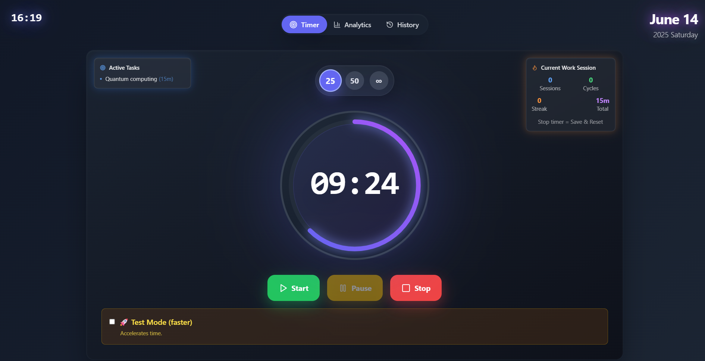
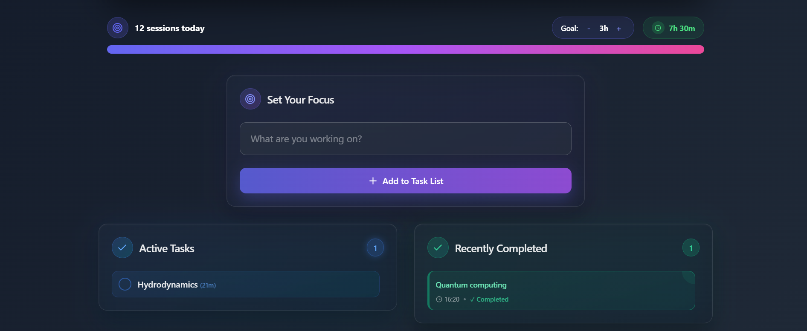
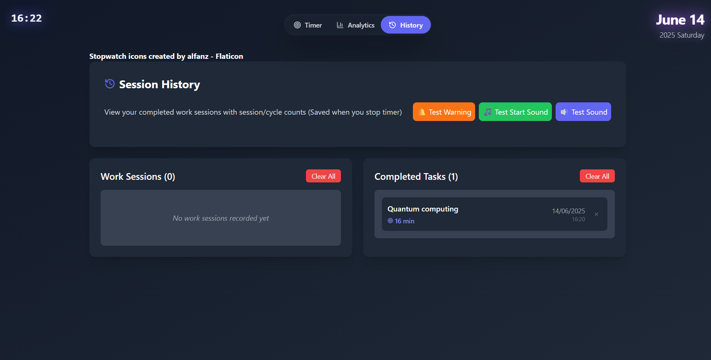

# 🕒 Pomodoro App

A lightweight and efficient **Pomodoro timer application** built with [Tauri](https://tauri.app), combining the power of Rust and the flexibility of JavaScript to deliver a fast and minimal desktop experience.

---

## 🚀 Features

- ⏱️ Pomodoro timer with work / short break / long break cycles
- 🔔 System notifications when a cycle ends
- 🎨 Clean and responsive UI
- 💾 Lightweight binary thanks to Tauri (<10MB)
- 🧭 Cross-platform (Windows, macOS, Linux)

---

## 🧑‍💻 Run in Development Mode

```bash
npm install
npm run tauri dev
```

---

## 🛠️ Build the Application

```bash
npm run tauri build
```

After building, you’ll find your app binaries in:
```swift
src-tauri/target/release/bundle/
```

---

## 🧪 Technologies Used

- 🦀 Rust
- ⚙️ Tauri
- 🌐 JavaScript / TypeScript
- 📦 npm

## 📦 Distribution Formats

| Platform | Format                               |
| -------- | ------------------------------------ |
| Windows  | `.msi`, `.exe (NSIS)`                |
| macOS    | `.dmg`, `.app` (built on macOS only) |
| Linux    | `.AppImage`, `.deb`, `.rpm`          |

---

##  📜 License

This project is licensed under the MIT License.
Feel free to use, modify, and distribute it.

---

## 🖼️ Screenshot

<p align="center">
  
  
  
  
</p>


---

## ✨ Coming Soon

- Fix "How to share data" button
- Option to not have/have the test mode
- Use Tailwind CSS properly
- Fix one warning
- Fix the time in active tasks when adding an active task during a session

---

## 👤 Author

Created by FeatAstro
