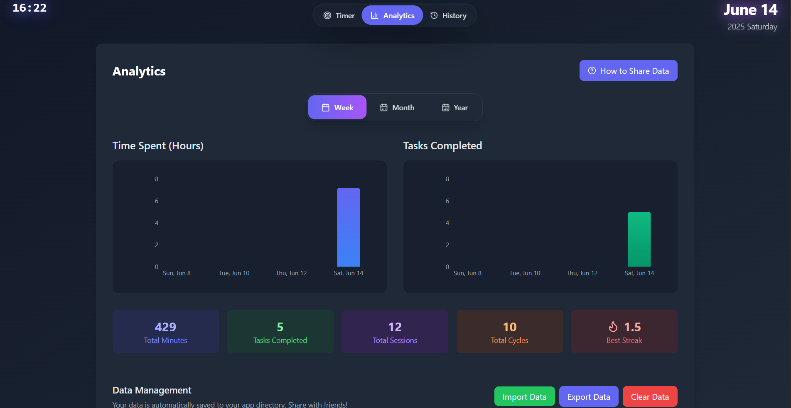

# 🍅 Advanced Pomodoro Focus Timer

A feature-rich **Pomodoro productivity application** built with [Tauri](https://tauri.app), offering comprehensive time tracking, task management, and analytics in a beautiful desktop interface.

<p align="center">
  
  
</p>

---

## ✨ Key Features

### 🎯 **Multiple Timer Modes**
- **25/5 Pomodoro**: Classic 25-minute work sessions with 5-minute breaks
- **50/10 Extended**: Longer 50-minute sessions with 10-minute breaks  
- **∞ Stopwatch**: Free-form timing for flexible work sessions

### 📋 **Smart Task Management**
- Create and manage multiple tasks during sessions
- Switch between active tasks while timer runs
- Real-time task time tracking with accumulated totals
- Auto-generated default "Focus Session" task
- Task completion with duration logging

### 📊 **Comprehensive Analytics**
- **Visual Charts**: Weekly, monthly, and yearly productivity views
- **Detailed Statistics**: Total minutes, completed tasks, sessions, and cycles
- **Streak Tracking**: Monitor your longest productivity streaks
- **Progress Goals**: Set and track daily time objectives

### 💾 **Data Management & Sharing**
- **Auto-save**: All data automatically persists locally
- **Export/Import**: Share progress with friends via JSON files
- **Backup & Restore**: Complete data backup functionality
- **Cross-session**: Task time accumulates across multiple sessions

### 🎨 **Beautiful Interface**
- **Modern Design**: Glassmorphic UI with smooth animations
- **Real-time Updates**: Live session tracking and task breakdown
- **Responsive Layout**: Scales beautifully across screen sizes
- **Dark Theme**: Easy on the eyes for long work sessions

### 🔊 **Audio Feedback**
- Session completion sounds
- Break time notifications  
- Final countdown alerts (3-2-1)
- Customizable audio cues

---

## 🚀 Quick Start

### Development Mode
```bash
# Install dependencies
npm install

# Run in development
npm run tauri dev
```

### Build for Production
```bash
# Create optimized build
npm run tauri build
```

Binaries will be available in:
```
src-tauri/target/release/bundle/
```

---

## 📱 Platform Support

| Platform | Formats Available | Size |
|----------|------------------|------|
| **Windows** | `.msi`, `.exe` | ~8MB |
| **macOS** | `.dmg`, `.app` | ~12MB |
| **Linux** | `.AppImage`, `.deb`, `.rpm` | ~10MB |

---

## 🛠️ Tech Stack

- **🦀 Backend**: Rust + Tauri (for native performance)
- **⚛️ Frontend**: React + JavaScript
- **🎨 Styling**: Tailwind CSS + Custom animations
- **📊 Charts**: Recharts for analytics visualization
- **🎵 Audio**: Web Audio API for sound effects
- **💾 Storage**: Local file system with JSON persistence

---

## 📸 Screenshots

<p align="center">
  
  
  
  
</p>

---

## 🎯 How to Use

1. **Choose Your Mode**: Select 25/5, 50/10, or stopwatch timing
2. **Add Tasks**: Create specific tasks to work on during your session  
3. **Start Focusing**: Begin your timer and switch between tasks as needed
4. **Track Progress**: View real-time stats and session breakdowns
5. **Stop to Save**: Press stop to save your session to permanent history
6. **Analyze**: Review your productivity patterns in the Analytics tab
7. **Share**: Export your data to share achievements with friends

---

## 🔄 Roadmap

- [ ] **Settings Panel**: Customize timer durations and sound preferences
- [ ] **Themes**: Multiple color schemes and UI variants  
- [ ] **Calendar Integration**: Sync with external calendar apps
- [ ] **Advanced Analytics**: Productivity trends and insights
- [ ] **Cloud Sync**: Optional cloud backup and multi-device sync
- [ ] **Team Features**: Shared sessions and group productivity tracking

---

## 🤝 Contributing

Contributions are welcome! Please feel free to submit issues, feature requests, or pull requests.

---

## 📄 License

This project is licensed under the **MIT License** - see the [LICENSE](LICENSE) file for details.

---

## 👨‍💻 Author

**Created by FeatAstro**
